# CardioEquation — System Architecture
**Patient-Specific ECG Generation using Diffusion Transformers**

> A comprehensive technical overview for academic review.

---

## 1. What Is CardioEquation?

CardioEquation is a **deep learning system that generates personalized, realistic ECG signals** for a specific patient. Given a short segment of a real patient's ECG as input, the system generates a new synthetic ECG that:

- Looks like **that patient's heart** (preserving morphology — P-wave shape, QRS complex, T-wave)
- Has **realistic rhythm** (heart rate, HRV)
- Is **clinically useful** for training diagnostic AI models, data augmentation, and privacy-preserving medical data sharing

---

## 2. High-Level System Overview

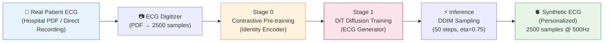

---

## 3. The Two-Stage Training Pipeline

### Overview

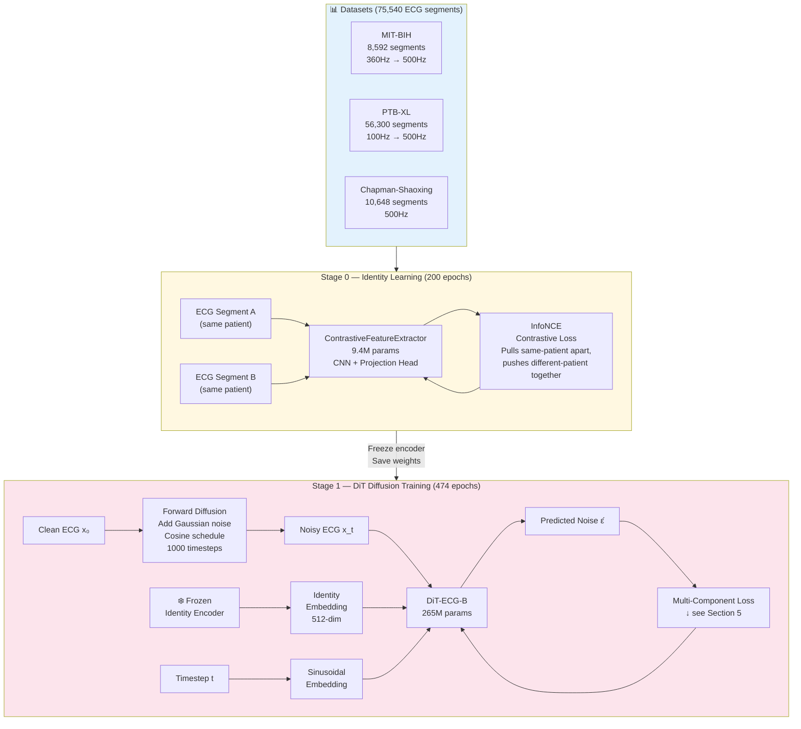

---

## 4. Core Model: DiT-ECG-B Architecture

The generator is a **Diffusion Transformer** adapted from DiT (Peebles & Xie, 2022) for 1D ECG signals.

### 4.1 Input Representation

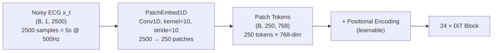

**Why patches?** Processing 2500 raw samples through self-attention would require 2500² = 6.25M attention pairs per layer. With patch size 10, this drops to 250² = 62,500 — **100× reduction**.

### 4.2 Conditioning Mechanism (AdaLN-Zero)

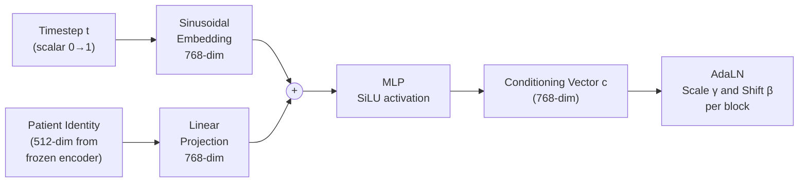

**AdaLN-Zero**: Instead of fixed LayerNorm, the model learns to modulate each layer differently based on the conditioning vector. Starts at zero (no modulation) and learns the right amount during training.

### 4.3 Single DiT Block

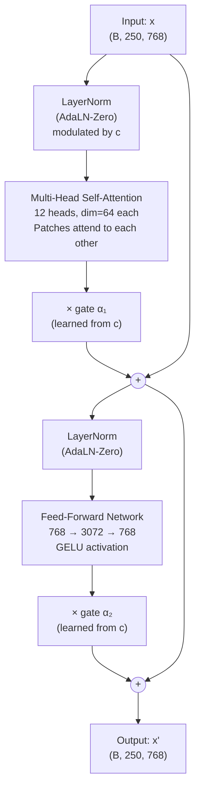

### 4.4 Output Head

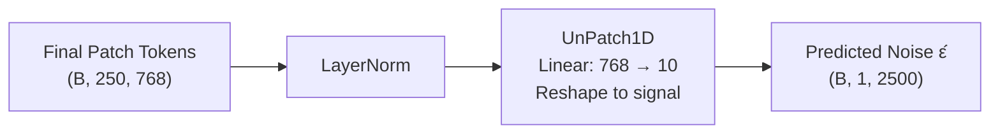

**Full DiT-ECG-B specs:**

| Parameter | Value |
|-----------|-------|
| Transformer blocks | 24 |
| Model dimension `d_model` | 768 |
| Attention heads | 12 |
| FFN expansion | 4× (3072) |
| Patch size | 10 (250 tokens) |
| Total parameters | **265M** |
| Precision | BF16 mixed |

---

## 5. Loss Function — Multi-Component Training Signal

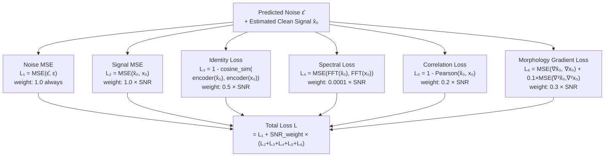

**SNR Weighting**: Auxiliary losses (L₂–L₆) are weighted by `α̅_t` (signal-to-noise ratio at timestep `t`). At high noise levels (large `t`), `α̅_t ≈ 0` so auxiliary losses are suppressed — only the denoising loss L₁ matters. At low noise (small `t`), `α̅_t ≈ 1` so all losses contribute equally. This ensures losses are applied only when the reconstructed signal `x̂₀` is reliable.

> **Run 4 Bug Found**: Spectral loss was producing values ~125 while all others were ~0.1. The weight was changed from 0.1 → 0.0001 to fix this.

---

## 6. Forward & Reverse Diffusion

### Forward Process (Training)


**Formula**: `x_t = √α̅_t · x₀ + √(1-α̅_t) · ε` where `ε ~ N(0,I)`

Uses **cosine noise schedule** (Nichol & Dhariwal, 2021) — smoother than linear, better for ECG morphology at fine scales.

### Reverse Process (Inference — DDIM with eta)

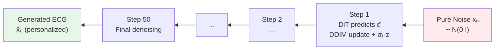

**DDIM with η=0.75**: Standard DDIM uses η=0 (deterministic). We use η=0.75 to re-inject stochastic noise at each step:

`σₜ = η × √((1-α̅ₜ₋₁)/(1-α̅ₜ) × (1-α̅ₜ/α̅ₜ₋₁))`

This increases **HR diversity** by preventing the model from always taking the same deterministic path.

---

## 7. Identity Encoder: ContrastiveFeatureExtractor

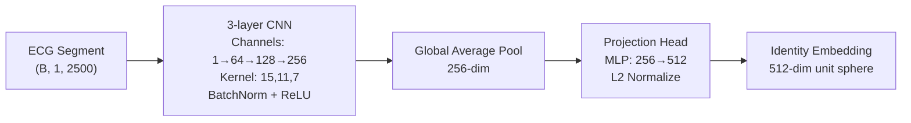

**Training**: InfoNCE contrastive loss. Two random crops from the **same patient** are pulled together in embedding space; crops from **different patients** are pushed apart.

**At inference**: Encoder is **frozen** — its weights do not change during DiT training. This ensures the identity space is stable and meaningful.

---

## 8. Inference Pipeline

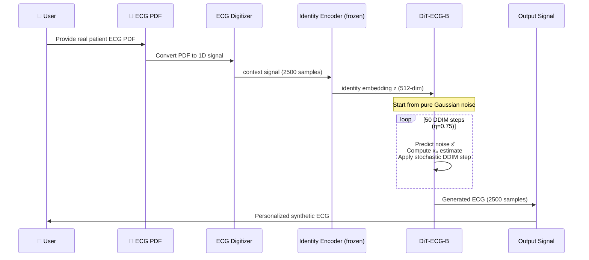

---

## 9. Data Flow & Preprocessing

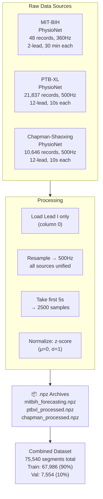

---

## 10. Training Configuration

| Setting | Value | Why |
|---------|-------|-----|
| Batch size | 16 (micro) | GPU memory constraint (A100 80GB shared) |
| Gradient accumulation | 16 steps | Effective batch = 256 |
| Learning rate | 1e-4 | AdamW, cosine decay |
| Warmup steps | 5,000 | Stable LR ramp-up |
| Max epochs | 500 | Early stopping at patience=30 |
| EMA decay | 0.9999 | Smoothed weights for inference |
| CFG dropout | 10% | Classifier-Free Guidance training |
| Diffusion timesteps | 1,000 | Standard DDPM/DDIM |
| DDIM steps (inference) | 50 | Speed/quality tradeoff |
| DDIM eta | 0.75 | HR diversity (new in Run 4) |
| Precision | BF16 | ~2× memory saving, minimal quality loss |

---

## 11. Evaluation Metrics

| Metric | What It Measures | Run 1 | Run 2 | Run 4 |
|--------|-----------------|-------|-------|-------|
| **FFD** ↓ | Overall signal quality (like FID for images) | 1032 | 42.0 | **21.7** |
| **MMD** ↓ | Distribution mismatch (real vs generated) | 0.661 | 0.383 | **0.432** |
| **HR MAE** ↓ | Mean absolute heart rate error (bpm) | 17.2 | 9.3 | 31.4* |
| **HR Std** | Diversity of generated heart rates | — | 21.1 | 20.5 |
| **Real HR Std** | Target diversity | — | — | **47.4** |
| **ReID Top-1** ↑ | Patient identity preserved (correct ID) | 11.8% | 5.9% | **11.8%** |
| **ReID Top-5** ↑ | Patient in top-5 predictions | 35.3% | 23.5% | **35.3%** |

*HR MAE worsened due to spectral loss imbalance bug (now fixed for Run 5)

---

## 12. Full System File Map

```
CardioEquation/
├── src/
│   ├── models/
│   │   ├── dit_ecg.py              ← Main generator (265M params)
│   │   └── feature_extractor_pt.py ← Identity encoder (9.4M params)
│   ├── training/
│   │   ├── train_contrastive.py    ← Stage 0: Identity pre-training
│   │   ├── train_dit.py            ← Stage 1: Diffusion training
│   │   ├── losses_v2.py            ← 6-component loss functions
│   │   ├── noise_scheduler.py      ← Cosine schedule + DDIM sampler
│   │   └── ema.py                  ← Exponential Moving Average
│   ├── inference/
│   │   └── pipeline_v2.py          ← End-to-end generation pipeline
│   └── evaluation/
│       └── clinical_validation.py  ← Hospital ECG evaluation
├── data/                           ← Downloaded datasets (.npz)
├── checkpoints/                    ← Saved model weights
├── docs/                           ← This document + future techniques
└── run_training.sh                 ← One-command full pipeline
```

---

## 13. Key Design Decisions & Rationale

| Decision | Alternative Considered | Why We Chose This |
|----------|----------------------|------------------|
| **DiT backbone** | U-Net (standard DDPM) | DiT scales better: bigger model = better quality. State-of-the-art for image generation (DALL-E 3, Stable Diffusion 3) |
| **Contrastive identity encoder** | Siamese network, AE | InfoNCE produces better-separated patient embeddings. Used in ECGTwin (2025) |
| **Cosine noise schedule** | Linear | Cosine is smoother at low noise levels — better for ECG fine structure (P-waves) |
| **DDIM sampling** | Full DDPM | 50 DDIM steps ≈ quality of 1000 DDPM steps. 20× faster inference |
| **η=0.75 stochastic DDIM** | η=0 deterministic | Deterministic DDIM collapses HR diversity. Stochasticity forces varied outputs |
| **SNR-weighted auxiliary losses** | Fixed weights | Prevents auxiliary instability at high noise timesteps. Proven in iDDPM (Nichol 2021) |
| **Frozen encoder during DiT training** | Joint fine-tuning | Fine-tuning corrupts carefully learned identity representations |

---

## 14. References

- **DiT**: Peebles & Xie (2022). *Scalable Diffusion Models with Transformers.* ICCV 2023.
- **DDIM**: Song et al. (2020). *Denoising Diffusion Implicit Models.* ICLR 2021.
- **iDDPM**: Nichol & Dhariwal (2021). *Improved DDPM.* ICML 2021.
- **ECGTwin**: (2025). *Personalized ECG generation using controllable diffusion.* arXiv:2508.
- **DiffuSETS**: Lai et al. (2025). *12-lead ECG generation conditioned on clinical text.* Patterns.
- **InfoNCE**: Oord et al. (2018). *Representation Learning with Contrastive Predictive Coding.*
- **Cosine schedule**: Nichol & Dhariwal (2021). *Improved DDPM.*
- **CFG**: Ho & Salimans (2022). *Classifier-Free Diffusion Guidance.*
