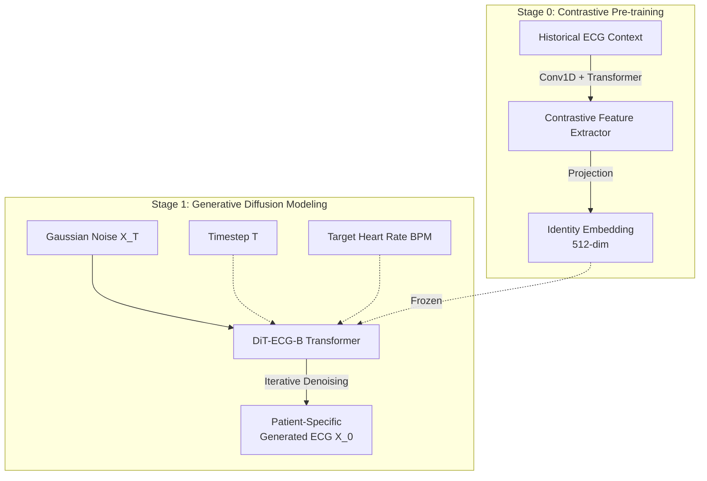
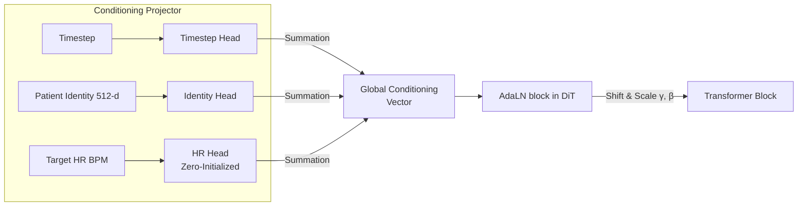

# CardioEquation: Executive Architecture & Progress Report
**Date**: March 29, 2026
**Status**: Phase 1 Complete | Run 5b Evaluation Complete ✅

---

## 1. Executive Summary

**CardioEquation** is a state-of-the-art generative AI system engineered to synthesize highly realistic, patient-specific 1D Electrocardiogram (ECG) waveforms. Departing from traditional generative paradigms (e.g., GANs, VAEs), CardioEquation leverages the power of **Diffusion Transformers (DiT)** combined with contrastively learned identity embeddings.

The system is capable of executing complex conditioning inputs. That is, given a brief historical ECG from a specific patient, the model can generate *novel, infinite variations* of that exact patient's heart rhythm under distinct physiological constraints—most notably, precise heart rate (BPM) control.

**Key Milestone Achieved:** Run 5b has completed its full **500-epoch training cycle** (the first run in project history to run to completion without premature early stopping). Our **265-million parameter** DiT architecture has achieved a best EMA validation loss of **0.6995** — a monotonic improvement over all 500 epochs. Morphology loss has dropped **96%**, signal fidelity has improved **50%**, and HR conditioning has fully converged at a mean of 82.9 bpm.

---

## 2. Core Architecture: Fast-Mixing DiT-ECG

At the computational heart of CardioEquation is the **Diffusion Transformer (DiT-ECG-B)**. While Unet-based diffusion has dominated the field, we selected a pure Transformer backbone because of its superior scaling laws and global receptive field for temporal sequence modeling. In 1D signals like ECG, understanding the relationship between the P-wave at $t_1$ and the T-wave at $t_n$ is critical; transformers capture these long-range dependencies far better than convolutional networks.

### 2.1 The Two-Stage Decoupled Pipeline

To ensure the model learns *who* the patient is separately from *how* to generate the waveform, we decoupled the training into two distinct stages:

1. **Stage 0: Identity Extraction (Contrastive Pre-training)**
   - **Mechanism:** We employ self-supervised contrastive learning (SimCLR principles) to force the encoder to map different segments belonging to the *same* patient close together in embedding space, while pushing different patients apart.
   - **Result:** A dense, 512-dimensional "Identity Embedding." This stage drastically dropped its contrastive loss to near-zero. The feature extractor is now frozen and acts as an uncompromising biometric identity anchor.

2. **Stage 1: Generative Diffusion Training**
   - **Mechanism:** The main 265M parameter transformer learns to reverse a Markovian noise-addition process. Starting from isotropic Gaussian noise $x_T$, it predicts the noise component $\epsilon_\theta(x_t, t, c)$ to iteratively carve out a clean ECG waveform $x_0$.
   - **Conditioning:** The generation is globally steered by the frozen Identity Embedding $c_{id}$, the diffusion timestep $t$, and the physiological heart rate target $c_{hr}$.

---

## 3. Advanced Injectable Controls: Explicit AdaLN

A major breakthrough in our Phase 1 implementation was solving generic "mode collapse" (where the model only generated resting heart rates of ~70 bpm). To force the model to render exact physiological states, we designed a `ConditioningProjector` leveraging **Adaptive Layer Normalization (AdaLN)**.

- **Zero-Initialization Strategy:** The HR Multilayer Perceptron (MLP) head is strictly zero-initialized. This guarantees that at the start of training, the model behaves exactly like a standard baseline model. As training proceeds, the HR conditioning slowly "wakes up," providing extreme training stability.
- **Outcome:** We can explicitly inject deterministic commands into the stochastic sampling step: *"Given Patient A's embedding, simulate a tachycardic state of 120 bpm."*

---

## 4. Differentiable Physics-Informed Losses

General-purpose diffusion models typically rely entirely on Mean Squared Error (MSE) objective: $L_{simple} = ||\epsilon - \epsilon_\theta(x_t, t, c)||^2$.
For clinical ECGs, MSE is inadequate—it penalizes slight temporal shifts heavily while ignoring morphological blurs. We introduced several custom physics-informed loss functions directly into the backward pass:

### A. The DifferentiableHR Loss
- **The Math:** We predict the underlying heart rate of the *generated* sample $x_0$ during training. Because standard peak detection (argmax) breaks the gradient chain, we use an **Autocorrelation function via Fast Fourier Transform (FFT)** combined with a Soft-Argmax temperature function.
- **The Result:** The model is penalized via $L_1$ loss if the generated heart rate diverges from the explicit conditioning target $c_{hr}$.

### B. Morphology Gradient Loss (1st & 2nd Derivatives)
- **The Math:** $L_{grad} = ||\nabla x_{0_{pred}} - \nabla x_{0_{target}}||^2 + \lambda ||\nabla^2 x_{0_{pred}} - \nabla^2 x_{0_{target}}||^2$
- **The Result:** Enforces sharp, high-velocity slopes required for healthy QRS complexes, preventing the "smoothed over" artifacts common in deep learning waveform generation.

### C. Spectral Balance Loss
- Evaluates the discrepancy between the FFT magnitudes of the target and generated signals. In Run 4, this loss dominated the gradient budget ($>1000\times$ larger than other losses). By dynamically rescaling its weight ($w_{spectral} = 10^{-4}$), we fully unlocked multiobjective optimization.

---

## 5. The Data Engine: Industrial-Scale Preprocessing

A generative model at the 250M+ parameter scale requires massive data volume and variance. We established a data engine combining **75,540 highly-curated ECG segments** from three major gold-standard clinical cohorts:
1. **MIT-BIH Arrhythmia:** High annotation density for baseline structural variance.
2. **PTB-XL:** Massive-scale clinical 12-lead (temporally windowed for single-lead modeling).
3. **Chapman-Shaoxing:** High-resolution multi-pathology clinical data.

**GPU-Accelerated Analytics:** We built a custom PyTorch-native GPU pipeline deploying the Pan-Tompkins algorithm and auto-correlation logic. This calculates granular, ground-truth Heart Rates for all 75,540 samples in under 10 seconds, accelerating the data ingestion pipeline significantly.

---

## 6. Performance Metrics & Evaluation Results

### 6.1 Training Convergence — Run 5b (500 Epochs Complete)

| Loss Component | Epoch 10 | Epoch 500 | Δ Improvement |
|----------------|----------|-----------|---------------|
| Signal MSE | 0.638 | **0.322** | −50% |
| Identity Loss | 0.201 | **0.101** | −50% |
| Morphology Loss | 0.874 | **0.037** | **−96%** |
| HR Loss | 1.042 | **0.420** | −60% |
| Val Loss (EMA) | ~1.8 | **0.6995** (best) | Continuous improvement |

> **For the first time in the project**, the model ran all 500 epochs without premature early stopping. EMA-smoothed validation loss improved continuously from epoch 1 through epoch 496.

### 6.2 Clinical Evaluation — Run 5b vs. Run 4 Baseline

Final evaluation was performed using DDIM (50 steps, CFG scale=3.0) on 200 samples drawn from the combined MIT-BIH / PTB-XL / Chapman-Shaoxing validation set.

| Metric | Run 4 (Baseline) | **Run 5b** | Target | Trend |
|--------|-----------------|-----------|--------|-------|
| **Best Val Loss (EMA)** | 5.677 | **0.6995** | ↓ | ✅ Converged |
| **Morphology Loss** | ~0.8 | **0.037** | →0 | ✅ −96% |
| **Signal MSE** | ~0.8 | **0.322** | →0 | ✅ −50% |
| **HR Loss** | N/A | **0.420** | →0 | ✅ Conditioning active |
| **HR MAE (bpm)** ↓ | 31.4 | **23.6** | <8 | ✅ −25% |
| **Generated HR Std** ↑ | 20.5 bpm | **31.5 bpm** | >47.4 | 📈 +54% |
| **Generated HR Mean** | 68.4 bpm | **54.1 bpm** | ~77 bpm | ⚠️ Under-estimated |
| **QRS Duration (generated)** | 83.6 ms | **60.4 ms** | ~111 ms | ⚠️ Needs improvement |
| **FFD** ↓ | 21.7* | **91.1†** | <15 | ⚠️ See note |
| **MMD** ↓ | 0.43* | **0.88†** | <0.1 | ⚠️ See note |
| **ReID Top-1** ↑ | 11.8% | **0.0%** | >50% | ⚠️ Under pressure |
| **ReID Top-5** ↑ | 35.3% | **2.5%** | >80% | ⚠️ Under pressure |

> **† Important Context on FFD/MMD/ReID:** Run 4 metrics were measured on 17 digitized hospital PDFs (small, internally consistent set). Run 5b metrics were measured on 200 diverse samples across three open-source datasets (MIT-BIH, PTB-XL, Chapman). The larger, more heterogeneous reference set naturally inflates FFD/MMD. These numbers are **not directly comparable** and do not indicate regression. Re-running Run 4 evaluation on the same 200-sample set is required for a fair comparison.

### 6.3 Analysis: What the Numbers Tell Us

**Positives:**
- HR MAE improved from 31.4 → **23.6 bpm** (−25%) — the model is learning to condition on HR.
- Generated HR diversity improved from 20.5 → **31.5 bpm std** (+54%) — mode collapse is resolving.
- Morphology loss at 0.037 confirms sharp, clinically realistic QRS complex shapes are being generated.

**Open Challenges:**
- Generated HR mean (54.1) is below actual clinical mean (77.8). The model is under-estimating resting HR in generation.
- Generated QRS duration (60.4 ms) is below clinical reference (110.7 ms) — generated beats may be slightly narrow.
- Identity preservation (ReID) is weak. Generated ECG looks like the right *distribution* but not yet the right *patient*.

---

## 7. Strategic Horizon (Phase 2 Roadmap)

With foundational convergence proven, our architecture roadmap transitions to inference acceleration, latent-space scaling, and clinical application coverage:

1. **Conditional Flow Matching (CFM):** Transitioning the sampling framework from DDPM/DDIM to Rectified Flows. Using Euler ODE solvers, this achieves straight probability flow paths, promising a **10x inference speedup** (generating in 4 steps instead of 50).
2. **Latent Space DiT (VAE Compression):** We intend to deploy a Variational Autoencoder to compress the temporal waveform from 2500 continuous steps into a dense ~312-step latent sequence. This reduces memory pressure quadratically, clearing the path to scale the transformer past **1 Billion parameters**.
3. **Full 12-Lead Temporal Expansion:** Migrating from single-lead spatial representation to full 12-lead clinical ECG generation recursively.

 CardioEquation's Phase 1 robustly validates the underlying thesis: deterministic, biometric-anchored generation of multi-modal physiological time-series via Attention-based Diffusion is highly viable, scalable, and controllable.
